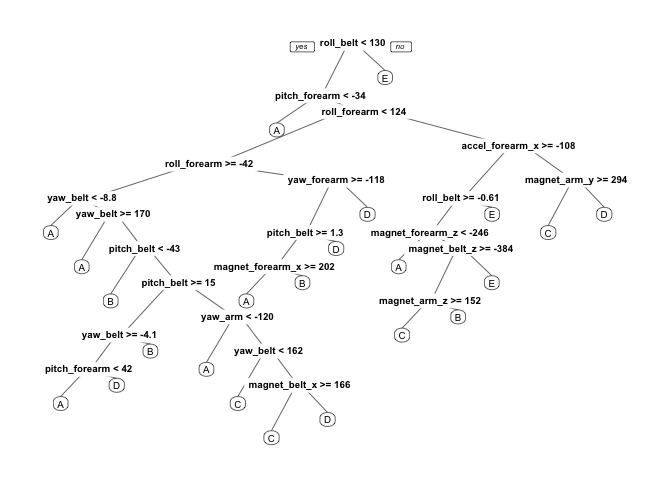

Assignment
----------

Using devices such as Jawbone Up, Nike FuelBand, and Fitbit it is now
possible to collect a large amount of data about personal activity
relatively inexpensively. These type of devices are part of the
quantified self movement ??? a group of enthusiasts who take
measurements about themselves regularly to improve their health, to find
patterns in their behavior, or because they are tech geeks. One thing
that people regularly do is quantify how much of a particular activity
they do, but they rarely quantify how well they do it.

In this project, your goal will be to use data from accelerometers on
the belt, forearm, arm, and dumbell of 6 participants. They were asked
to perform barbell lifts correctly and incorrectly in 5 different ways.
More information is available from the website here:
<http://groupware.les.inf.puc-rio.br/har> (see the section on the Weight
Lifting Exercise Dataset).

Preparation
-----------

Following libraries are required for this assignment.

    library(dplyr)
    library(ggplot2)
    library(caret)
    library(rpart)
    library(rpart.plot)

Load data
---------

We download the prediction writeup data and load the csv files.

    download.file("https://d396qusza40orc.cloudfront.net/predmachlearn/pml-training.csv", 
        destfile = "pml-training.csv")
    download.file("https://d396qusza40orc.cloudfront.net/predmachlearn/pml-testing.csv", 
        destfile = "pml-testing.csv")
    pml.training <- read.csv("pml-training.csv")
    pml.testing <- read.csv("pml-testing.csv")

Tidy data
---------

Before we get into the prediction we require to clean the data. In this
case the data contains alot of NA values, which can influence our
prediction in a negative way. So we will clean up the data in order to
have an accurate prediction as possible.

Our first clean up is reducing the number of columns to the onces that
have been mentioned in the assignment. We only use the columns that have
belt, forearm, arm, and dumbell.

We only use one dataset in order to perform the clean up. We bind the
training and test set into the pml set. After that we filter only the
columns with arm, beld, dumbell, classe.

The training and test set do not have the same number of columns. So
they can not be bind by default. For this we will add each missing
column to each set.

    pml.testing$classe <- NA
    pml.training$problem_id <- NA

    pml <- rbind(pml.training, pml.testing)
    pml <- select(pml, matches("arm|belt|dumbell|classe|problem_id"))

In order for our prediction to be most accurate we will remove the rows
that contain NA values.

    pml.cols <- c(colnames(pml[colSums(is.na(pml)) == 0]), colnames(pml[115:116]))
    pml.feat <- pml[pml.cols]
    pml.feat %>% filter(complete.cases(.))

    ##  [1] roll_belt           pitch_belt          yaw_belt           
    ##  [4] total_accel_belt    gyros_belt_x        gyros_belt_y       
    ##  [7] gyros_belt_z        accel_belt_x        accel_belt_y       
    ## [10] accel_belt_z        magnet_belt_x       magnet_belt_y      
    ## [13] magnet_belt_z       roll_arm            pitch_arm          
    ## [16] yaw_arm             total_accel_arm     gyros_arm_x        
    ## [19] gyros_arm_y         gyros_arm_z         accel_arm_x        
    ## [22] accel_arm_y         accel_arm_z         magnet_arm_x       
    ## [25] magnet_arm_y        magnet_arm_z        roll_forearm       
    ## [28] pitch_forearm       yaw_forearm         total_accel_forearm
    ## [31] gyros_forearm_x     gyros_forearm_y     gyros_forearm_z    
    ## [34] accel_forearm_x     accel_forearm_y     accel_forearm_z    
    ## [37] magnet_forearm_x    magnet_forearm_y    magnet_forearm_z   
    ## [40] classe              problem_id         
    ## <0 rows> (or 0-length row.names)

Train model
-----------

Before we train our model we require to the creation of a training and a
test set. We use the pml set for the creation of both.

    pml.part <- createDataPartition(y = pml.feat$classe, p=0.7, list=FALSE)
    training <- pml.feat[pml.part,] 
    testing <- pml.feat[-pml.part,]

Now we will train our model with the **random forest** method. This
algorithm as it selects most important variables automatically. A **5
fold cross validation** to the traning of the model. In order to dermine
the best mehod we could have applied an ada boost method on the set. Due
to the limitations of the project random forest will suffice.

The training of the model can take a long time. Our computer works
usually with one core. We increase the number of cores assigned to the
training of the model to increase performance.

    library(doMC)
    registerDoMC(cores = 8)
    pml.rf <- train(as.factor(classe)~., data = training[1:40],  
                      method = "rf", na.action = na.omit, 
                      trControl = trainControl(method = "cv", 5),allowParallel = TRUE)
    print(pml.rf)

    ## Random Forest 
    ## 
    ## 13737 samples
    ##    39 predictor
    ##     5 classes: 'A', 'B', 'C', 'D', 'E' 
    ## 
    ## No pre-processing
    ## Resampling: Cross-Validated (5 fold) 
    ## Summary of sample sizes: 10989, 10990, 10990, 10989, 10990 
    ## Resampling results across tuning parameters:
    ## 
    ##   mtry  Accuracy   Kappa    
    ##    2    0.9875516  0.9842515
    ##   20    0.9866783  0.9831489
    ##   39    0.9823104  0.9776252
    ## 
    ## Accuracy was used to select the optimal model using  the largest value.
    ## The final value used for the model was mtry = 2.

This method seems like a good fit as we achieve a high accuracy.

Confusion and statistics
------------------------

Now we will make **prediction, confusion matrix** that applies to the
**20 test cases** available within the testing set.

    pml.validate <- predict(pml.rf, testing)
    confusionMatrix(pml.validate, testing$classe)

    ## Confusion Matrix and Statistics
    ## 
    ##           Reference
    ## Prediction    A    B    C    D    E
    ##          A 1673    2    1    0    0
    ##          B    0 1135   19    0    0
    ##          C    0    2  999   14    0
    ##          D    1    0    7  950    3
    ##          E    0    0    0    0 1079
    ## 
    ## Overall Statistics
    ##                                          
    ##                Accuracy : 0.9917         
    ##                  95% CI : (0.989, 0.9938)
    ##     No Information Rate : 0.2845         
    ##     P-Value [Acc > NIR] : < 2.2e-16      
    ##                                          
    ##                   Kappa : 0.9895         
    ##  Mcnemar's Test P-Value : NA             
    ## 
    ## Statistics by Class:
    ## 
    ##                      Class: A Class: B Class: C Class: D Class: E
    ## Sensitivity            0.9994   0.9965   0.9737   0.9855   0.9972
    ## Specificity            0.9993   0.9960   0.9967   0.9978   1.0000
    ## Pos Pred Value         0.9982   0.9835   0.9842   0.9886   1.0000
    ## Neg Pred Value         0.9998   0.9992   0.9945   0.9972   0.9994
    ## Prevalence             0.2845   0.1935   0.1743   0.1638   0.1839
    ## Detection Rate         0.2843   0.1929   0.1698   0.1614   0.1833
    ## Detection Prevalence   0.2848   0.1961   0.1725   0.1633   0.1833
    ## Balanced Accuracy      0.9993   0.9962   0.9852   0.9916   0.9986

We obtain a **99.1% accuracy** with an **out of sample error** of less
then **1%**.

### Random forest visualization

Here follows a visualization of the partial random forest method
applied.

    pml.tree <- rpart(classe ~ ., data=training, method="class")
    prp(pml.tree)

